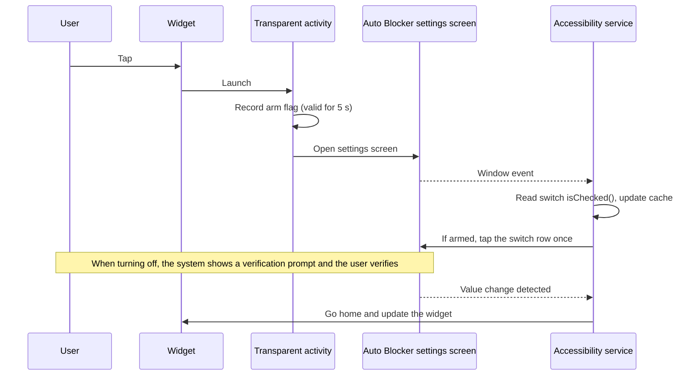

# ShieldTap

한국어: [README.md](README.md)

> One-tap home screen toggle for Samsung Galaxy **Auto Blocker**.


Auto Blocker keeps a Galaxy phone safer, but every time you sideload an APK or use wireless debugging you have to dig deep into Settings to turn it off. ShieldTap puts that switch in a single 2x1 home screen widget. One tap turns it on or off, and the widget shows the current state with color and text.

<p align="center">
  
</p>

| State | Background | Shows (English UI) |
|---|---|---|
| On | Green | `Auto Blocker` / `On` `Checked HH:mm` |
| Off | Amber | `Auto Blocker` / `Off` `Checked HH:mm` |
| Unknown | Slate | `Auto Blocker` / `Unknown` |

`Checked HH:mm` is the time the switch state was last read. It is not shown in the unknown state.

The image is not a screenshot. It is a preview drawn from `res/layout/widget.xml` and the drawable definitions, rendered with the Korean strings. The app follows the phone language (English or Korean). The real widget size, corners and font vary a little by launcher and device.

ShieldTap is an unofficial app made by an individual and is not affiliated with Samsung Electronics. Auto Blocker is the name of a Samsung feature.

## Features

- **Zero permissions.** The manifest has no `uses-permission` at all. There is no internet permission either, so no data ever leaves the device.
- **Narrow accessibility scope.** The accessibility service only looks at the screens of one app, the Auto Blocker system app built into One UI (`com.samsung.android.rampart`). It receives no screen content from other apps.
- **No security bypass.** When you turn Auto Blocker off, the fingerprint or PIN prompt still appears and you pass it yourself. The widget never does it for you.
- **Step-by-step setup.** Open ShieldTap from the app drawer and it checks where you are and guides you through only the remaining steps (allow restricted settings, turn on accessibility, add the widget, read the current state, finish up after installing). Tap `Details` on any step to see what to tap and why, and buttons open the settings screens you need. Tapping the widget while accessibility is off opens this screen. There are also buttons to check for updates and to open App info (uninstall).
- **Acts only when you tap.** If you open the Auto Blocker settings screen yourself, ShieldTap taps nothing.
- **Lightweight build.** No Gradle. Android build-tools and JDK 17 produce the APK in seconds.

## Compatibility

| Item | Value |
|---|---|
| Tested device | Galaxy SM-F971N |
| Tested One UI | 9.0 |
| Required apps | Nothing to install. Auto Blocker (`com.samsung.android.rampart`) is a system app built into One UI 6 and later |
| Minimum to work | One UI 6.0 (based on Android 14), because Auto Blocker was introduced in One UI 6 |
| Minimum to install | Android 8.0 (API 26, `minSdkVersion`). Below One UI 6 the app installs but has nothing to toggle |
| Language | English and Korean. The app follows the phone language. On Android 13 and later you can pick it per app in Settings > Apps > ShieldTap > Language |
| Other models | Screen size, resolution, foldable or not, and language make no difference, because the switch is found by its internal ID, not by screen coordinates |
| Other One UI versions | Not verified. If Samsung changes the internal IDs on the settings screen, ShieldTap stops working |

## Install: regular users

> This procedure was verified on a real device running One UI 9.0, including the setup screen. Other models and One UI versions were not tested. If you get stuck, use "Install: developers (adb)" below.

### Before you install

0. **Turn off Auto Blocker first.** Settings > Security and privacy > Auto Blocker. While it is on, installing APKs from outside official stores is blocked ([Samsung support](https://www.samsung.com/us/support/answer/ANS10003636)).
1. **Temporarily turn off Play Protect app scanning.** Play Store > profile icon at the top right > Play Protect > ⚙ at the top right > turn off `Scan apps with Play Protect`. While it is on, installation is blocked with a message that the app was blocked to protect your device. Play Protect blocks APKs downloaded from a browser or messenger when they request accessibility access ([Google Security Blog](https://security.googleblog.com/2024/02/piloting-new-ways-to-protect-Android-users-from%20financial-fraud.html?m=1)). ShieldTap runs as an accessibility service, so it hits this rule.

### Install and set up

2. Download `shieldtap-v<version>.apk` (for example `shieldtap-v0.08.02.00.apk`) from [Releases](../../releases/latest) and tap it to install. For extra safety, check that the file matches the SHA-256 in the release notes.
3. **Right after installing, turn Play Protect app scanning back on.** It is the same screen as step 1.
4. Open **ShieldTap** from the app drawer and follow the 5 steps on screen in order. Finished steps change to ✓ and only the remaining steps stay expanded. Tap `Details` on any step to see what to tap and why.
   - **① Allow restricted settings:** tap `Open App info` > ⋮ at the top right > **Allow restricted settings**, verify, then tap `Done`. Android 13 and later block apps installed from outside an app store from using accessibility until you allow it ([Google help](https://support.google.com/android/answer/12623953)). If the ⋮ menu does not show this option, tap `Done`, go to ② and try turning it on once. According to an Android 13 analysis, the option can appear only after you have seen the "Restricted setting" dialog once ([Esper](https://www.esper.io/blog/android-13-sideloading-restriction-harder-malware-abuse-accessibility-apis)). If accessibility is already on, this step is marked ✓ automatically.
   - **② Turn on accessibility:** tap `Open Accessibility settings` and turn on ShieldTap under Accessibility > Installed apps. If a "Restricted setting" dialog appears, go back to ① and allow it.
   - **③ Add the widget to your home screen:** tap `Add widget to home screen` and the system add dialog appears. If there is no button, touch and hold an empty spot on the home screen, tap Widgets and place ShieldTap as 2x1.
   - **④ Read the current state:** tap `Read state` to open the Auto Blocker settings screen. Do not touch the switch. When the screen opens, tap Back.
   - **⑤ Finish up after installing:** turn the two things you switched off for installing back on. Use `Open Play Protect settings` to turn app scanning on, and `Turn on Auto Blocker` to turn Auto Blocker on. The turn-on button taps nothing if Auto Blocker is already on. When you are done, tap `Finish setup`.
   - **Recommended, turn back on after 30 minutes:** tap `Open auto turn-on option` to open the Auto Blocker screen. Turn on `Turn on Auto Blocker automatically` there (One UI 8.5 and later), and if you turn Auto Blocker off with the widget and forget, it comes back on after 30 minutes. The option may be near the bottom of the screen.
5. When `All set` appears, you are done. From then on, each tap on the widget switches between On and Off.

## Updating and uninstalling

**Updating.** Open ShieldTap from the app drawer and tap `Check for updates` to open the latest release page in your browser. If it is newer than the version shown at the bottom of the app screen, download `shieldtap-v<version>.apk` and install it over the current app. The version in the file name uses the same format as the one in the app, so you can compare them directly. Your settings and widget stay as they are. As with the first install, turn off Play Protect app scanning for a moment while installing. The app does not check for updates itself so that it can stay without internet permission.

For new-version notifications, add `https://github.com/shieldtap/shieldtap` to [Obtainium](https://github.com/ImranR98/Obtainium). It watches GitHub releases and tells you when a new version is out. Whether Play Protect also blocks installs made through Obtainium has not been verified.

**Uninstalling.** Touch and hold the ShieldTap icon in the app drawer and tap `Uninstall`, or tap `Open App info (uninstall)` in the app.

## Install: developers (adb)

This path was verified on SM-F971N with One UI 9.0. Auto Blocker blocks USB commands while it is on, so turn it off first.

```
adb install -r shieldtap-v<version>.apk
./enable_accessibility.sh <adb-serial>
```

Then open the app as in step 4 above and follow ③, ④ and ⑤. ① and ② are done when the script turns on accessibility.

`enable_accessibility.sh` turns on the accessibility service with `settings put secure` under shell privileges, so you do not need to touch the phone and you skip the restricted settings step. Before writing, it prints the current `enabled_accessibility_services` value and appends our service with `:` only if it is not already there. It never overwrites the existing value.

## How it works



- **No coordinate taps.** ShieldTap finds the switch node by its internal ID in the accessibility node tree and sends `ACTION_CLICK` to that node (`src/com/gml/autoblocker/AutoTapService.java:96-102`). That is why it depends on the One UI version more than on the device model.
- **Stops if the switch is missing.** If the ID changed and the node is not there, it taps nothing and shows `Couldn't find the switch on the settings screen.` after 5 seconds (`AutoTapService.java:48-60`). Fallbacks such as "the first switch on the screen" are deliberately left out, so it never taps a different switch on the same screen (such as `Maximum restrictions` on One UI 6.1.1 and later).
- The state the widget shows is a cache of the switch state the accessibility service last read from the settings screen. ShieldTap neither reads nor writes the system setting value.
- On every window event of the settings screen, the accessibility service reads `isChecked()` of the switch (`sesl_switchbar_switch`). Only within the 5 seconds the arm flag is valid does it tap the switch row (`sesl_switchbar_container`) once.
- It goes back home only after `isChecked()` on the same window differs from the value before the tap. Until the value changes it sends no Home or Back.
- If you cancel verification and the value does not change, it stops watching after 10 seconds and does nothing.

## Security notes

| Check | Evidence |
|---|---|
| No requested permissions (including internet) | 0 `uses-permission` entries in `AndroidManifest.xml` |
| Widget, trampoline and accessibility service are not exported | `android:exported="false"` at `AndroidManifest.xml:28`, `:39` and `:46`. Only the setup screen opened from the app drawer (`MainActivity`, `:18`) is exported so the launcher can start it |
| Only one other app is queried: the Play Store | `<queries>` at `AndroidManifest.xml:6-8` declares only `com.android.vending`. This is not a permission. It is the fallback path that opens the Play Store when the Play Protect settings screen cannot be opened |
| Accessibility events limited to the rampart package | `android:packageNames` at `res/xml/accessibility_service_config.xml:3` |
| Backup disabled | `android:allowBackup="false"` in `AndroidManifest.xml` |

An accessibility service is a powerful permission, so check the source and the SHA-256 before installing a downloaded APK. Building it yourself is the most reliable option.

## Build

ShieldTap builds with build-tools (`aapt2`, `d8`, `zipalign`, `apksigner`) and JDK 17, without Gradle. You can change the SDK path with `ANDROID_SDK_ROOT`.

```
./build.sh
```

The output is `build/shieldtap-v<version>.apk`. The version comes from the `vA.BB.CC.DD` label at the start of the commit subject. An APK you build yourself is signed with a different key from the release build, so it cannot be installed over the release build. Uninstall the existing app first if you want to switch.

## Limitations

- Regular apps cannot read `rampart_main_switch_enabled` (`Settings key ... is not readable`, the @hide key restriction in Android 12 and later). It is readable only from adb shell.
- One UI rejects writes to `rampart_main_switch_enabled` (`RAMPART_SettingsProvider: Not allowed to put`), so ShieldTap taps the settings screen UI instead.
- The widget shows a cache, so it can go stale if the state changes elsewhere. The One UI 8.5+ `Turn on Auto Blocker automatically` option turns Auto Blocker back on 30 minutes after it is turned off (observed).
- It stops working if the viewIds on the settings screen change, so it is fragile across One UI updates.
- Turning on Auto Blocker disconnects wireless debugging. Turning it off restores it.
- ShieldTap is not published on Google Play or the Galaxy Store. It is distributed only through GitHub releases.

## License

Licensed under the [Apache License 2.0](LICENSE). You are free to use, modify and distribute it. When distributing, include `LICENSE` and `NOTICE`.

The outline of the shield icons (`res/drawable/ic_shield_*.xml` and the app icon `res/drawable/ic_launcher_fg.xml`) is the `verified_user` (outlined) path from Google [Material Icons](https://github.com/google/material-design-icons), with a check mark and dot added. Material Icons is also licensed under Apache License 2.0.
