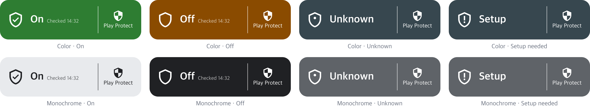
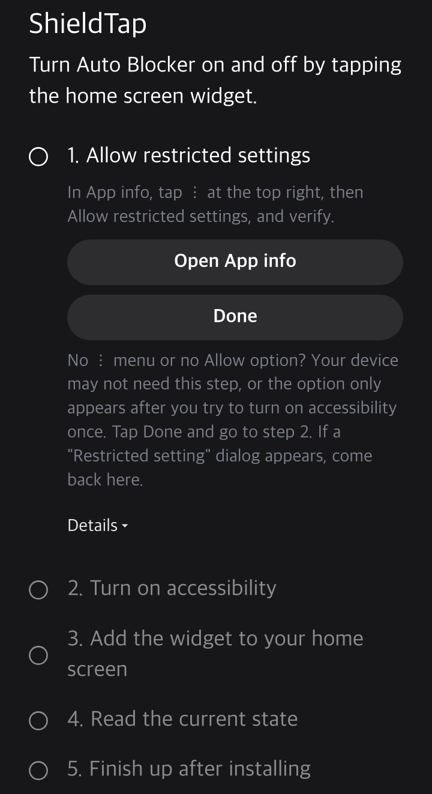
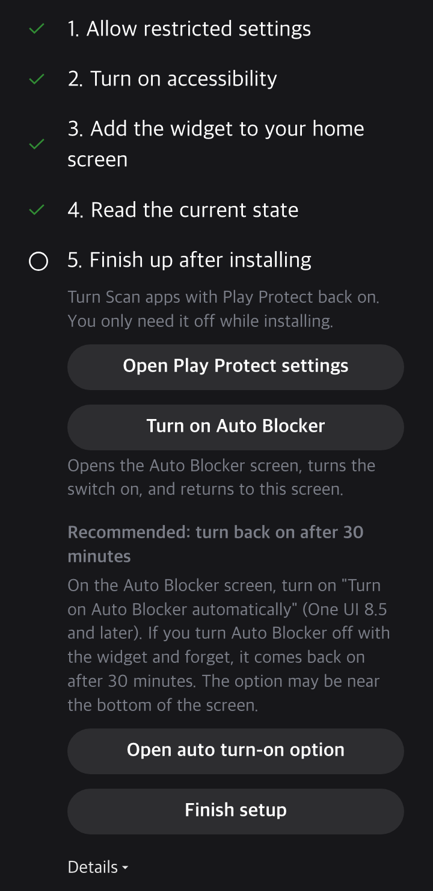
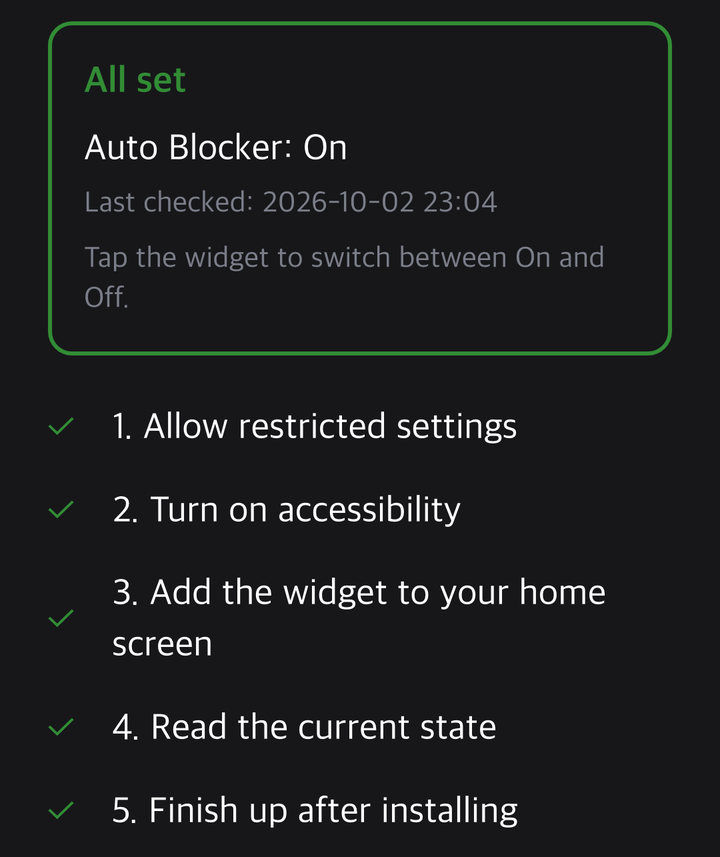
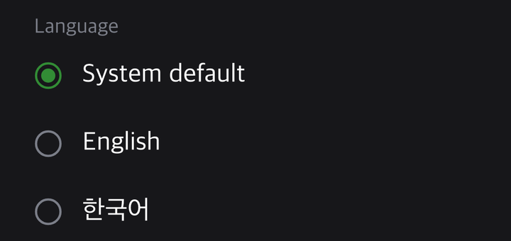

# ShieldTap

<p align="center">
  
</p>

<p align="center">
  <strong>English</strong> · <a href="README.ko.md">한국어</a>
</p>

<p align="center">
  <a href="#install">install</a> ·
  <a href="docs/guide.md#how-it-works">how it works</a> ·
  <a href="docs/guide.md#security-notes">security</a> ·
  <a href="#docs">docs</a> ·
  <a href="https://github.com/shieldtap/shieldtap/releases/latest">releases</a>
</p>

<p align="center">
  <a href="LICENSE"></a>
  <a href="https://github.com/shieldtap/shieldtap/releases/latest"></a>
  <a href="docs/guide.md#compatibility"></a>
  <a href="docs/guide.md#security-notes"></a>
</p>

---

<p align="center">
  
  <br>
  
</p>

<p align="center"><sub>The widget in its three states: on, off and unknown · a preview drawn from the app layout and English strings, not a device screenshot</sub></p>

**Unknown** is not an error. After a reboot or an app update, and whenever ShieldTap could not check, the widget shows Unknown instead of guessing. If wireless or USB debugging is on at that point, it shows Off instead. No public signal tells that Auto Blocker is on (Samsung blocks reading it). Opening the Auto Blocker screen in Settings once reads the real state without changing it. Tapping the widget switches it and updates the state at the same time. **Setup needed** means the ShieldTap accessibility service is off, and tapping opens the setup guide. [Widget states →](docs/guide.md#widget-states)

**Turn Samsung Auto Blocker on or off from the home screen with one tap.**

Auto Blocker keeps a Galaxy phone safer, but sideloading an APK or using wireless debugging means digging into Settings to turn it off. ShieldTap puts that switch in a resizable widget (2x1 by default) that shows the current state with color and text.

<table>
  <tr>
    <td width="50%" valign="top">
      
      <br><b>Set up in five guided steps</b>
      <br><sub>Each step opens the settings screen it needs and turns into a check mark when done.</sub>
    </td>
    <td width="50%" valign="top">
      
      <br><b>Turn protection back on after installing</b>
      <br><sub>Step 5 turns Play Protect scanning and Auto Blocker back on, the two things switched off for the install.</sub>
    </td>
  </tr>
  <tr>
    <td width="50%" valign="top">
      
      <br><b>See the state at a glance</b>
      <br><sub>After setup, the app shows the last state it read and when it read it.</sub>
    </td>
    <td width="50%" valign="top">
      
      <br><b>Pick English or Korean</b>
      <br><sub>The app follows the phone language, or you choose one at the bottom of the screen.</sub>
    </td>
  </tr>
</table>

<p align="center"><sub>Each image is the setup screen redrawn from the app strings and layout, not a device capture.</sub></p>

- **Switches with one tap.** In the Color style the widget turns green for on and amber for off, with the time the state was last read. [Widget states →](docs/guide.md#widget-states)
- **Resizes and comes in several styles.** The widget shrinks to just the shield icon at one cell. Pick the 3x1 widget (ShieldTap + Play Protect) in the widget list to get a Play Protect settings shortcut as well. Touching and holding it opens settings where each widget can be Color, Monochrome, Custom or, on Android 12 and later, System colors that follow your wallpaper. Custom lets you pick each state color from presets, hue, saturation and brightness sliders, or a #RRGGBB code. [Widget states →](docs/guide.md#widget-states)
- **Also works from Quick Settings.** Pull down the notification shade, open the tile editor (pencil or Edit) and drag ShieldTap into your tiles. The tile shows the same state as the widget and switches the same way. [Quick Settings tile →](docs/guide.md#quick-settings-tile)
- **Takes requests from automation apps.** If you already use MacroDroid or Tasker, it can turn Auto Blocker on or off through ShieldTap. Turning off still asks for your fingerprint or PIN. [Advanced: automation apps →](#advanced-automation-apps)
- **Runs with zero permissions.** The manifest has no `uses-permission` entry, including internet, so nothing leaves the phone. [Security notes →](docs/guide.md#security-notes)
- **Watches one screen only.** The accessibility service receives events only from the Auto Blocker system app and taps only within 5 seconds after you tap the widget, the Quick Settings tile or the `Turn on Auto Blocker` button in setup, or after an automation app asks to turn it on or off. [How it works →](docs/guide.md#how-it-works)
- **Keeps your own verification.** Turning Auto Blocker off still shows the fingerprint or PIN prompt, and you pass it yourself.
- **Finds the switch by ID, not by position.** Screen size and resolution do not enter into it, because the switch is found by its internal ID. One device is verified so far. [Compatibility →](docs/guide.md#compatibility)
- **Comes in English and Korean.** The choice at the bottom of the app is the same value as the per-app language on Android 13 and later. Touch and hold a widget to give that widget its own language. By default it follows the app language.

---

## install

**[Download the latest APK](https://github.com/shieldtap/shieldtap/releases/latest)** (`shieldtap-v<version>.apk`) and open it on the phone.

ShieldTap needs One UI 6 or later, where Auto Blocker exists. It installs on Android 8.0 (API 26) and later, but below One UI 6 there is nothing to toggle. It was verified on a One UI 9.0 device. [Compatibility →](docs/guide.md#compatibility)

**Before you install, turn off two things.**

1. **Auto Blocker.** Settings > Security and privacy > Auto Blocker. While it is on, APKs from outside official stores are blocked.
2. **Play Protect app scanning.** Play Store > profile icon > Play Protect > ⚙ > `Scan apps with Play Protect`. Play Protect blocks downloaded APKs that request accessibility access, and ShieldTap is an accessibility service.

**Then set it up.**

1. Install the APK and turn Play Protect app scanning back on.
2. Open **ShieldTap** from the app drawer and follow the five steps on screen: ① `Allow restricted settings`, ② `Turn on accessibility`, ③ `Add the widget to your home screen`, ④ `Read the current state`, ⑤ `Finish up after installing`.
3. In step 5, turn Auto Blocker back on. On One UI 8.5 and later, `Turn on Auto Blocker automatically` turns it back on 30 minutes after you turn it off with the widget.
4. When `All set` appears, each widget tap switches between On and Off. [Step by step →](docs/guide.md#install-step-by-step)

**Update** with `Check for updates` in the app, which opens the latest release page; install the new APK over the current one and your settings and widget stay. If you use [Obtainium](https://github.com/ImranR98/Obtainium), add `https://github.com/shieldtap/shieldtap` and it tells you when a new version is out. **Uninstall** with `Open App info (uninstall)`. [Updating and uninstalling →](docs/guide.md#updating-and-uninstalling)

Developers can install with adb and turn on the service from a script. [Install with adb →](docs/guide.md#install-with-adb)

## advanced: automation apps

Most people install an APK only now and then. When the Auto Blocker window blocks an install, tap the widget or the Quick Settings tile. That needs no extra app and costs no battery. An automation app has to keep reading the screen to catch the window, so it can use more battery. It is recommended only if you already use MacroDroid or Tasker. In that case it can ask ShieldTap to turn Auto Blocker off when the window appears. Turning off still asks for your fingerprint or PIN, and you return to the install screen afterwards.

| | MacroDroid (tested) | Tasker (not tested) |
|---|---|---|
| Trigger | Screen Content with the window title: `Unknown app blocked` in English, `출처를 알 수 없는 앱 차단됨` in Korean | Event > Plugin > AutoInput > UI Update with the same title |
| Skip its own editor | Turn on `Don't read when MacroDroid is open` | Add an App context with Tasker and turn on Invert |
| Action | Send Intent: Target `Activity`, Action `com.gml.autoblocker.action.TURN_OFF`, Package `com.gml.autoblocker` | Send Intent: the same Action and Package, Class `com.gml.autoblocker.ActionActivity`, Target `Activity` |

Screen Content reads the screen every 2 seconds in the free version. `TURN_ON` and the app shortcuts work the same way. Regular expressions for several languages and a trigger that does not read the screen: [Automation →](docs/guide.md#automation-macrodroid-tasker)

## docs

Start with the [user guide](docs/guide.md): [widget states](docs/guide.md#widget-states) · [compatibility](docs/guide.md#compatibility) · [install step by step](docs/guide.md#install-step-by-step) · [updating and uninstalling](docs/guide.md#updating-and-uninstalling) · [install with adb](docs/guide.md#install-with-adb) · [automation](docs/guide.md#automation-macrodroid-tasker) · [how it works](docs/guide.md#how-it-works) · [security notes](docs/guide.md#security-notes) · [limitations](docs/guide.md#limitations) · [icon credits](docs/guide.md#icon-credits).

## development

ShieldTap builds without Gradle. It needs Android build-tools (`aapt2`, `d8`, `zipalign`, `apksigner`), the `android-34` platform and JDK 17. Set `ANDROID_SDK_ROOT` if the SDK is not in the default path.

```bash
git clone https://github.com/shieldtap/shieldtap.git
cd shieldtap
./build.sh
```

The APK lands in `build/shieldtap-v<version>.apk`. The version comes from the `vA.BB.CC.DD` label of the last commit that changed `src`, `res` or `AndroidManifest.xml`, so commits that only touch docs keep the app version, or from `VERSION_NAME` and `VERSION_CODE` set together. A self-built APK has a different signature from the release APK, so uninstall the release app before installing your own build.

## license

[Apache-2.0](LICENSE). Copyright 2026 Gyu Min Lee. See [NOTICE](NOTICE) for the Material Icons attribution. When distributing, include `LICENSE` and `NOTICE`.

ShieldTap is an unofficial app made by an individual and is not affiliated with Samsung Electronics. Auto Blocker is the name of a Samsung feature.
