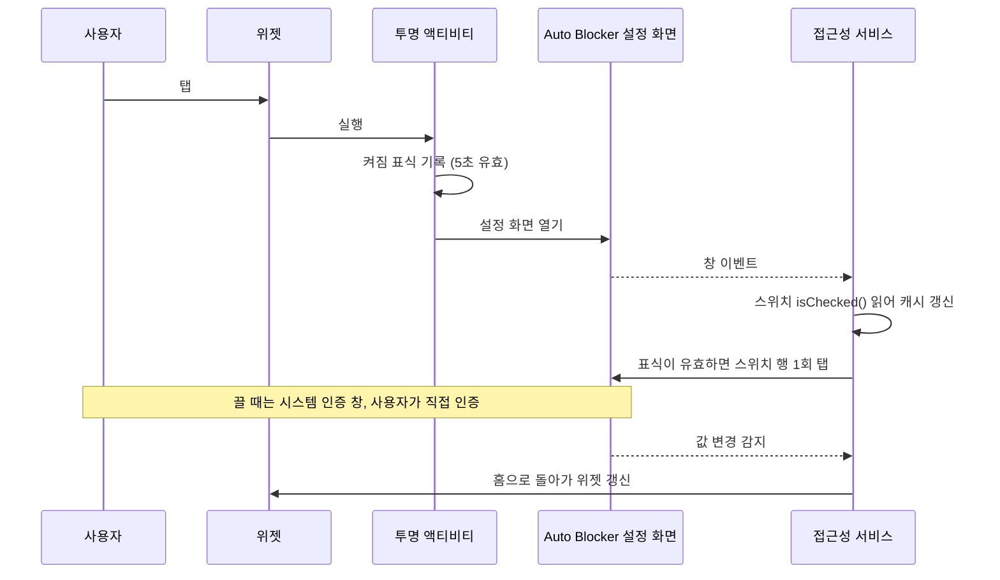

# ShieldTap 쉴드탭

> One-tap home screen toggle for Samsung Galaxy **Auto Blocker** (보안 위험 자동 차단).


갤럭시의 보안 위험 자동 차단은 켜 두면 안전하지만 APK 설치나 무선 디버깅을 할 때마다 설정 깊숙이 들어가 꺼야 합니다. 이 앱은 그 스위치를 홈 화면 2x1 위젯 한 칸으로 꺼냅니다. 탭 한 번에 켜고 끄며 현재 상태를 색과 글자로 보여 줍니다.

<p align="center">
  
</p>

| 상태 | 배경 | 표시 |
|---|---|---|
| 켜짐 | 초록 | `보안 위험 자동 차단` / `켜짐` `HH:mm 확인` |
| 꺼짐 | 호박색 | `보안 위험 자동 차단` / `꺼짐` `HH:mm 확인` |
| 미확인 | 슬레이트 | `보안 위험 자동 차단` / `상태 미확인` |

`HH:mm 확인` 은 마지막으로 스위치 상태를 읽은 시각입니다. 미확인 상태에는 붙지 않습니다.

이미지는 실제 화면 캡처가 아니라 `res/layout/widget.xml` 과 drawable 정의를 그대로 옮겨 그린 미리보기입니다(`docs/render_widget_states.sh` 로 다시 만들 수 있습니다). 실제 위젯의 크기, 모서리, 글꼴은 런처와 기기에 따라 조금 다릅니다.

ShieldTap 은 개인이 만든 비공식 앱이며 삼성전자와 관계가 없습니다. Auto Blocker 는 삼성전자의 기능 이름입니다.

## 특징

- **권한 0개.** 매니페스트에 `uses-permission` 이 하나도 없습니다. 인터넷 권한도 없어 어떤 데이터도 기기 밖으로 나가지 않습니다.
- **좁은 접근성 범위.** 접근성 서비스는 One UI 에 기본 탑재된 Auto Blocker 시스템 앱(`com.samsung.android.rampart`) 하나의 화면만 봅니다. 다른 앱의 화면 내용은 받지 않습니다.
- **보안 우회 없음.** 끌 때 뜨는 지문 또는 비밀번호 인증은 그대로 사용자가 직접 통과합니다. 위젯은 인증을 대신하지 않습니다.
- **단계별 설정 안내.** 앱 서랍의 ShieldTap 을 열면 지금 상태를 읽어 남은 단계(접근성 켜기, 위젯 추가, 상태 읽어 오기, 설치 뒤 마무리)만 안내합니다. 단계마다 `자세히` 를 누르면 무엇을 누르고 왜 필요한지 나오고 필요한 설정 화면은 버튼으로 바로 열립니다. 접근성이 꺼진 채 위젯을 누르면 이 화면이 열립니다. 업데이트 확인과 앱 정보(삭제) 버튼도 있습니다.
- **탭했을 때만 동작.** 사용자가 설정 화면을 직접 열었을 때는 아무것도 누르지 않습니다.
- **가벼운 빌드.** Gradle 없이 Android build-tools 와 JDK 17 만으로 수 초 안에 APK 가 나옵니다.

## 호환성

| 항목 | 값 |
|---|---|
| 검증 기기 | Galaxy SM-F971N |
| 검증 One UI | 9.0 |
| 필요한 앱 | 따로 설치할 앱 없음. Auto Blocker(`com.samsung.android.rampart`)는 One UI 6 이상에 기본 탑재된 시스템 앱입니다 |
| 작동 최소 버전 | One UI 6.0 (Android 14 기반). Auto Blocker 가 One UI 6 부터 들어갔기 때문입니다 |
| 설치 최소 버전 | Android 8.0 (API 26, `minSdkVersion`). One UI 6 미만에서는 설치는 되지만 켤 대상이 없습니다 |
| 다른 기종 | 화면 크기, 해상도, 폴더블 여부, 언어는 영향이 없습니다. 좌표가 아니라 내부 ID 로 스위치를 찾기 때문입니다 |
| 다른 One UI 버전 | 미확인. 삼성이 설정 화면의 내부 ID 를 바꾸면 동작하지 않습니다 |

## 설치: 일반 사용자

> 이 경로는 Google 공식 문서([제한된 설정](https://support.google.com/android/answer/12623953))를 따른 안내이며 One UI 9.0 에서 아직 직접 검증하지 않았습니다. 1번과 3번은 국내 사용자 보고를 따른 안내입니다. 막히면 아래 「설치: 개발자 (adb)」 경로를 쓰세요.

0. **보안 위험 자동 차단을 먼저 끕니다.** 설정 > 보안 및 개인정보 보호 > 보안 위험 자동 차단. 켜져 있으면 공식 스토어 밖의 APK 설치가 막힙니다([Samsung 안내](https://www.samsung.com/us/support/answer/ANS10003636)).
1. **Play 프로텍트 앱 검사를 잠시 끕니다.** Play 스토어 > 오른쪽 위 프로필 > Play 프로텍트 > 오른쪽 위 ⚙ > `Play 프로텍트로 앱 검사` 끄기. 켜져 있으면 `기기 보호를 위해 앱 차단됨` 이 뜨며 설치가 막힙니다. 브라우저나 메신저로 받은 APK 가 접근성 권한을 요청하면 Play 프로텍트가 설치를 막기 때문입니다([Google 보안 블로그](https://security.googleblog.com/2024/02/piloting-new-ways-to-protect-Android-users-from%20financial-fraud.html?m=1)). ShieldTap 은 접근성 서비스로 동작하므로 이 조건에 걸립니다.
2. [Releases](../../releases/latest) 에서 `shieldtap-v<버전>.apk` (예: `shieldtap-v0.08.00.00.apk`) 를 받아 탭해 설치합니다. 릴리스 노트의 SHA-256 과 받은 파일이 같은지 확인하면 더 안전합니다.
3. **설치가 끝나면 Play 프로텍트 앱 검사를 바로 다시 켭니다.** 1번과 같은 화면입니다.
4. 앱 서랍의 **ShieldTap** 을 엽니다. 화면의 3단계를 순서대로 따릅니다. 끝난 단계는 ✓ 로 바뀌고 남은 단계만 펼쳐집니다.
   - **① 접근성 켜기:** `접근성 설정 열기` 를 눌러 ShieldTap 을 켭니다. `제한된 설정` 안내 창이 뜨면 확인을 누르고 `앱 정보 열기` > 오른쪽 위 ⋮ > **제한된 설정 허용** 을 누른 뒤 다시 켭니다. 이 메뉴는 안내 창을 한 번 본 뒤에만 나타납니다([Esper 분석](https://www.esper.io/blog/android-13-sideloading-restriction-harder-malware-abuse-accessibility-apis)). 설치 방식에 따라서는 제한이 걸리지 않아 바로 켜질 수 있습니다.
   - **② 홈 화면에 위젯 추가:** `홈 화면에 위젯 추가` 를 누르면 시스템 추가 창이 뜹니다. 버튼이 없으면 홈 화면 빈 곳을 길게 눌러 위젯에서 ShieldTap 을 2x1 로 배치합니다.
   - **③ 현재 상태 읽어 오기:** `상태 읽어 오기` 를 누르면 보안 위험 자동 차단 설정 화면이 열립니다. 스위치는 누르지 않습니다. 화면이 열리면 뒤로 가기를 누릅니다.
   - **④ 설치 뒤 마무리:** 설치하려고 끈 두 가지를 다시 켭니다. `Play 프로텍트 설정 열기` 로 앱 검사를 켜고 `보안 위험 자동 차단 켜기` 로 차단을 켭니다. 켜기 버튼은 이미 켜져 있으면 아무것도 누르지 않습니다. 다 했으면 `마무리 완료` 를 누릅니다.
   - **권장, 30분 뒤 자동으로 다시 켜기:** `자동으로 켜기 설정 열기` 를 누르면 보안 위험 자동 차단 화면이 열립니다. 그 화면의 `자동으로 켜기` 를 켜 두면 위젯으로 끈 뒤 잊어도 30분 뒤 다시 켜집니다. 옵션은 화면 아래쪽에 있을 수 있습니다.
5. `준비 완료` 가 뜨면 끝입니다. 그다음부터는 위젯을 탭할 때마다 켜짐과 꺼짐이 바뀝니다.

## 업데이트와 삭제

**업데이트.** 앱 서랍의 ShieldTap 아이콘 > `업데이트 확인` 을 누르면 브라우저로 최신 릴리스 페이지가 열립니다. 화면 아래 버전보다 새 버전이면 `shieldtap-v<버전>.apk` 를 받아 덮어 설치합니다. 파일 이름의 버전과 앱 화면 아래 버전이 같은 형식이라 바로 비교할 수 있습니다. 설정과 위젯은 그대로 남습니다. 설치할 때는 처음처럼 Play 프로텍트 앱 검사를 잠깐 꺼야 합니다. 앱이 직접 확인하지 않는 것은 인터넷 권한을 두지 않기 위해서입니다.

새 버전 알림을 받고 싶으면 [Obtainium](https://github.com/ImranR98/Obtainium) 에 `https://github.com/shieldtap/shieldtap` 을 추가하세요. GitHub 릴리스를 지켜보다가 새 버전이 나오면 알려 줍니다. Obtainium 으로 설치할 때도 Play 프로텍트에 막히는지는 확인하지 못했습니다.

**삭제.** 앱 서랍의 ShieldTap 아이콘을 길게 눌러 `삭제` 를 누르거나 앱 화면의 `앱 정보 열기 (삭제)` 를 누릅니다.

## 설치: 개발자 (adb)

이 경로는 SM-F971N, One UI 9.0 에서 검증했습니다. 보안 위험 자동 차단이 켜져 있으면 USB 명령이 막히므로 먼저 끕니다.

```
adb install -r shieldtap-v<버전>.apk
./enable_accessibility.sh <adb시리얼>
```

그다음 위 4번처럼 앱을 열어 ②, ③, ④ 단계를 따릅니다. ①은 스크립트가 이미 끝냈습니다.

`enable_accessibility.sh` 는 shell 권한의 `settings put secure` 로 접근성 서비스를 켜므로 폰을 조작하지 않아도 되고 제한된 설정 단계도 거치지 않습니다. 실행 전에 기존 `enabled_accessibility_services` 값을 출력하고 우리 서비스가 없을 때만 `:` 로 이어 붙입니다. 기존 값은 덮어쓰지 않습니다.

## 동작 원리



- **좌표를 누르지 않습니다.** 접근성 노드 트리에서 내부 ID 로 스위치 노드를 찾아 그 노드에 `ACTION_CLICK` 을 보냅니다(`src/com/gml/autoblocker/AutoTapService.java:96-102`). 그래서 기종보다 One UI 버전에 좌우됩니다.
- **못 찾으면 멈춥니다.** ID 가 바뀌어 노드가 없으면 아무것도 누르지 않고 5초 뒤 `설정 화면에서 스위치를 찾지 못했습니다` 를 띄웁니다(`AutoTapService.java:48-60`). 같은 화면의 다른 스위치(One UI 6.1.1 이상의 `최대 제한` 등)를 잘못 누르지 않도록 "첫 번째 스위치" 같은 대체 탐색은 일부러 넣지 않았습니다.
- 위젯이 보여 주는 값은 접근성 서비스가 설정 화면에서 마지막으로 읽은 스위치 상태의 캐시입니다. 시스템 설정 값은 읽지도 쓰지도 않습니다.
- 접근성 서비스는 설정 화면의 창 이벤트마다 스위치(`sesl_switchbar_switch`)의 `isChecked()` 를 읽습니다. 표식이 유효한 5초 안에만 스위치 행(`sesl_switchbar_container`)을 한 번 탭합니다.
- 같은 창에서 `isChecked()` 가 탭 전 값과 달라진 뒤에만 홈으로 돌아갑니다. 값이 바뀌기 전에는 홈이나 뒤로 가기를 보내지 않습니다.
- 인증을 취소해 값이 안 바뀌면 10초 뒤 감시를 접고 아무것도 하지 않습니다.

## 보안 메모

| 확인 항목 | 근거 |
|---|---|
| 요청 권한 없음 (인터넷 포함) | `AndroidManifest.xml` 에 `uses-permission` 0건 |
| 모든 컴포넌트 외부 비공개 | `AndroidManifest.xml:11`, `:22`, `:29` 의 `android:exported="false"` |
| 접근성 이벤트를 rampart 패키지로 한정 | `res/xml/accessibility_service_config.xml:3` 의 `android:packageNames` |
| 백업 비활성 | `AndroidManifest.xml` 의 `android:allowBackup="false"` |

접근성 서비스는 강한 권한이므로 받은 APK 는 소스와 SHA-256 을 확인하고 설치하세요. 직접 빌드하면 가장 확실합니다.

## 빌드

Gradle 없이 build-tools(`aapt2`, `d8`, `zipalign`, `apksigner`)와 JDK 17로 빌드합니다. SDK 경로는 `ANDROID_SDK_ROOT` 로 바꿀 수 있습니다.

```
./build.sh
```

결과물은 `build/shieldtap-v<버전>.apk` 입니다(예: `build/shieldtap-v0.08.00.00.apk`). 환경변수 없이 빌드하면 `.keystore/debug.jks` 디버그 키로 서명합니다. 이 키는 머신마다 처음 한 번 새로 만들어지고 저장소에 올라가지 않으므로 개인 시험용입니다.

## 릴리스 절차 (관리자용)

안드로이드는 같은 패키지를 같은 키로 서명한 APK 만 업데이트로 받아 줍니다. 배포용 APK 는 반드시 하나로 고정한 릴리스 키로 서명합니다. 키를 잃으면 받은 사람 모두 앱을 지우고 다시 설치해야 합니다.

1. 릴리스 키를 한 번 만들고 저장소 밖에 보관합니다(예: `$HOME/.android/auto-blocker-release.jks` 와 비밀번호 관리자).

   ```
   keytool -genkeypair -keystore "$HOME/.android/auto-blocker-release.jks" \
     -alias release -keyalg RSA -keysize 4096 -validity 10000
   ```

2. 버전은 커밋 라벨을 그대로 씁니다. 이 저장소의 커밋 제목은 `vA.BB.CC.DD: 요약` 형식이고 `build.sh` 가 HEAD 커밋 제목의 라벨에서 버전을 계산합니다. `versionName` 은 라벨에서 `v` 를 뺀 값(예: `0.07.00.00`)이고 `versionCode` 는 `A×1000000 + BB×10000 + CC×100 + DD`(예: `70000`)입니다. 라벨이 커질수록 versionCode 도 커지므로 기존 사용자는 덮어 설치로 업데이트할 수 있습니다. 릴리스할 커밋(보통 master 최신)에서 빌드합니다.

   ```
   RELEASE_KS="$HOME/.android/auto-blocker-release.jks" RELEASE_KS_ALIAS=release \
   RELEASE_KS_PASS='<비밀번호>' ./build.sh
   ```

   HEAD 제목에 라벨이 없으면 빌드가 멈춥니다. 필요하면 `VERSION_NAME` 과 `VERSION_CODE` 를 둘 다 직접 줄 수 있습니다. 빌드 끝에 버전, 서명 인증서, APK 의 SHA-256 이 출력됩니다.

3. 같은 라벨로 GitHub Release 를 만들고 SHA-256 을 노트에 적습니다. 태그도 커밋 라벨과 같게 씁니다.

   ```
   gh release create v0.07.00.00 build/shieldtap-v0.07.00.00.apk \
     --title "ShieldTap v0.07.00.00" --notes "APK SHA-256: <값>"
   ```

Google Play 와 Galaxy Store 배포는 하지 않습니다. 시스템 설정 스위치를 자동으로 누르는 접근성 서비스는 장애 지원 목적이 아니어서 Play 접근성 API 정책 심사를 통과하기 어렵다고 봅니다(추정).

## 제약

- 일반 앱은 `rampart_main_switch_enabled` 를 읽을 수 없습니다(`Settings key ... is not readable`, 안드로이드 12 이상의 @hide 키 제한). adb shell 에서만 읽힙니다.
- One UI 가 `rampart_main_switch_enabled` 쓰기를 거부하므로(`RAMPART_SettingsProvider: Not allowed to put`) 설정 화면 UI 를 자동으로 누르는 방식을 씁니다.
- 위젯 표시는 캐시라서 화면 밖에서 상태가 바뀌면 낡을 수 있습니다. One UI 의 `자동으로 켜기` 설정은 끄고 30분 뒤 다시 켭니다(관측).
- 설정 화면의 viewId 가 바뀌면 동작하지 않습니다. One UI 업데이트에 취약합니다.
- 보안 위험 자동 차단을 켜면 무선 디버깅이 끊깁니다. 끄면 복구됩니다.
- 이 저장소에서 기계로 검증한 범위는 빌드, 서명, 서비스 바인드, 설치 뒤 앱 프로세스 크래시 없음까지입니다. 탭으로 켜고 끄는 경로와 끌 때의 인증 창 동작은 사용자 시험으로 확인합니다.

## 라이선스

[Apache License 2.0](LICENSE) 을 따릅니다. 자유롭게 쓰고 고치고 배포할 수 있으며 배포할 때는 `LICENSE` 와 `NOTICE` 를 함께 넣어 주세요.

방패 아이콘(`res/drawable/ic_shield_*.xml`, 앱 아이콘 `res/drawable/ic_launcher_fg.xml`)의 외곽선은 Google [Material Icons](https://github.com/google/material-design-icons) 의 `verified_user` (outlined) 경로를 가져와 체크와 점을 덧붙였습니다. Material Icons 도 Apache License 2.0 입니다.
