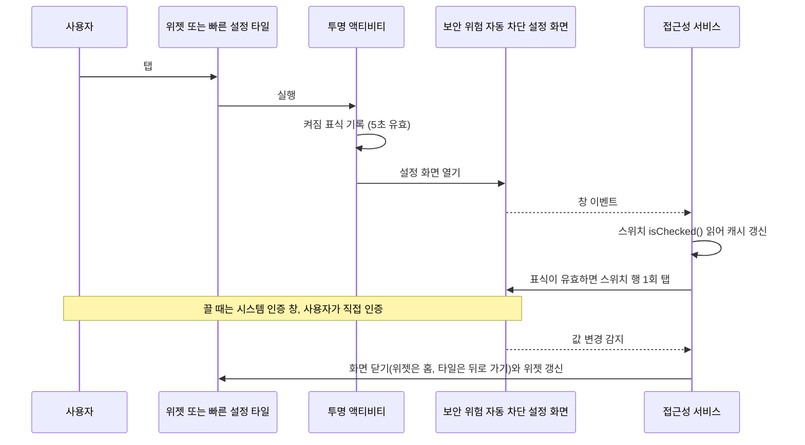

# ShieldTap 사용 안내

<p align="center">
  <a href="guide.md">English</a> · <strong>한국어</strong>
</p>

[README](../README.ko.md) 에서 링크한 상세 내용입니다. 위젯 상태, 호환성, 설정 단계, 업데이트, adb 경로, 자동화 앱 연동, 동작 원리, 보안 메모, 제약을 다룹니다.

## 위젯 상태

<p align="center">
  
</p>

| 상태 | 배경 | 표시 |
|---|---|---|
| 켜짐 | 초록 | `켜짐` `HH:mm 확인` |
| 꺼짐 | 호박색 | `꺼짐` `HH:mm 확인` |
| 미확인 | 슬레이트 | `상태 미확인` |
| 설정 필요 | 슬레이트 | `설정 필요` |

`HH:mm 확인` 은 마지막으로 스위치 상태를 읽거나 변경 알림을 받거나 디버깅 설정으로 꺼짐을 확정한 시각입니다. 미확인과 설정 필요 상태에는 붙지 않습니다. 설정 필요는 ShieldTap 접근성 서비스가 꺼져 있다는 뜻입니다. 위젯은 그릴 때마다 켜진 접근성 서비스 공개 목록에서 이것을 확인합니다. 한 칸 크기에서는 상태 미확인의 점 대신 `!` 가 있는 빈 방패로 보입니다. 탭하면 지금처럼 설정 안내 화면이 열립니다. 서비스를 켜거나 끄면 위젯이 바로 다시 그려집니다. 시스템이 그 콜백 없이 서비스를 멈추면 앱을 열 때, 위젯 정기 갱신 때, 언어를 바꿀 때 같은 다음 갱신에 바뀝니다. 위젯에는 제목 줄이 없습니다. 방패 아이콘과 상태만으로 무엇을 켜고 끄는지 보입니다.

위젯 크기는 조절할 수 있습니다. 한 칸 정도로 좁히면 방패 아이콘만 보입니다. 위젯 목록에는 ShieldTap 항목이 둘 있습니다. 2x1 위젯과 ShieldTap + Play 프로텍트라는 3x1 위젯입니다. 3x1 위젯은 오른쪽에 Play 프로텍트 바로가기가 있고 3칸보다 작게 줄일 수 없습니다. 바로가기를 누르면 Play 프로텍트 화면이 열리고 그 화면을 열 수 없으면 Play 스토어가 열립니다. 처음 한 번만 오른쪽 위 ⚙ 를 눌러 Play 프로텍트로 앱 검사로 가라는 안내 창이 뜨고 Play 프로텍트 열기를 누르면 열립니다. 열기를 누르지 않고 닫으면 다음에 다시 뜹니다. 그 스위치 화면은 Play 스토어가 자기 ⚙ 버튼으로만 들어가게 해서 ShieldTap 을 포함해 어떤 앱도 바로 열 수 없습니다. 화면을 열기만 하고 Play 프로텍트 설정을 대신 바꾸지는 않습니다. 나머지 부분을 탭하면 지금처럼 보안 위험 자동 차단이 바뀝니다. 바로가기는 위젯 스타일의 글자색 한 가지로 칠해집니다. 스타일은 위젯마다 컬러(윗줄), 모노톤(아랫줄), 사용자 지정 중에서 고릅니다. 모노톤은 색 대신 명도로 상태를 구분합니다. 켜짐은 밝고 꺼짐은 어두우며 상태 미확인은 그 중간입니다. 사용자 지정 스타일에서는 상태마다 바탕색을 프리셋 20색, 색상·채도·명도 슬라이더, #RRGGBB 코드 중 편한 방법으로 고를 수 있습니다. 글자는 흰색과 진한 색 중 대비가 높은 쪽으로 정해집니다. Android 12 이상에서는 네 번째 스타일인 시스템 색을 고를 수 있습니다. 배경화면에서 색을 가져와 켜짐은 밝은 강조색, 꺼짐은 어두운 무채색, 상태 미확인은 중간 무채색으로 보입니다. 시스템 색은 배경화면마다 달라서 위 그림에는 넣지 않았습니다. 위젯을 길게 누르고 위젯 설정을 열면 바꿀 수 있습니다.

이미지는 실제 화면 캡처가 아니라 `res/layout/widget.xml` 과 drawable 정의를 그대로 옮겨 그린 미리보기입니다. 그림은 영어 UI 기준이고 한국어 폰에서는 `켜짐` 처럼 표시됩니다. 실제 위젯의 크기, 모서리, 글꼴은 런처와 기기에 따라 조금 다릅니다.

## 빠른 설정 타일

ShieldTap 은 빠른 설정 타일도 제공합니다. 알림창을 내려 타일 편집(연필 아이콘 또는 편집)을 열고 ShieldTap 타일을 사용 중인 타일 쪽으로 끌어 놓으면 됩니다. 타일은 위젯과 같은 캐시를 읽습니다. 켜짐이면 타일이 강조되고 Android 10 이상에서는 둘째 줄에 `켜짐`, `꺼짐`, `상태 미확인`, `설정 필요` 중 하나가 나옵니다. 탭하면 위젯 탭과 같은 경로로 전환하고 알림창을 닫습니다. 위젯과 달리 전환 뒤 홈 화면으로 가지 않습니다. 뒤로 가기를 한 번 보내 보안 위험 자동 차단 화면을 닫으므로 타일을 누르기 전 화면으로 돌아갑니다. 화면이 잠겨 있으면 먼저 잠금 해제를 요청합니다. 접근성이 꺼져 있으면 대신 설정 안내 화면이 열립니다.

## 자동화 앱 연동

MacroDroid, Tasker 같은 자동화 앱이 ShieldTap 에 보안 위험 자동 차단 켜기나 끄기를 요청할 수 있습니다. 언제 요청할지는 자동화 앱이 정합니다. 예를 들어 화면에 보안 위험 자동 차단의 차단 문구가 뜰 때 요청하게 할 수 있습니다. ShieldTap 은 요청을 위젯 탭과 같은 방식으로 처리합니다.

| 요청 | Intent 액션 | 앱 바로가기 (ID) |
|---|---|---|
| 켜기 | `com.gml.autoblocker.action.TURN_ON` | `보안 위험 자동 차단 켜기` (`turn_on`) |
| 끄기 | `com.gml.autoblocker.action.TURN_OFF` | `보안 위험 자동 차단 끄기` (`turn_off`) |

두 액션은 `com.gml.autoblocker/.ActionActivity` 액티비티를 엽니다(클래스 `com.gml.autoblocker.ActionActivity`, 카테고리 `android.intent.category.DEFAULT`). 전환 액션은 없습니다. extra 는 무시하고 두 액션이 아닌 호출은 아무것도 하지 않습니다. 앱 바로가기 두 개도 같은 액티비티를 엽니다. ShieldTap 아이콘을 길게 누르면 보이고 바로가기만 실행할 수 있는 자동화 앱을 위한 것입니다.

- 접근성이 꺼져 있으면 위젯 탭처럼 설정 안내 화면이 열립니다.
- 켜져 있으면 보안 위험 자동 차단 화면을 열어 스위치를 한 번 누릅니다. 스위치가 이미 요청한 상태면 아무것도 누르지 않습니다.
- **쓰던 화면으로 돌아갑니다.** 스위치 값이 바뀐 뒤나 이미 요청한 상태일 때 ShieldTap 은 홈 대신 뒤로 가기를 한 번 보냅니다. 그러면 보안 위험 자동 차단 화면이 닫히고 쓰던 앱이 다시 보입니다. 방금 차단된 설치 화면이 그 예입니다.
- **끄기는 지문 또는 비밀번호 인증이 필요합니다.** One UI 가 인증 창을 띄우고 자동화 앱은 대신 통과할 수 없습니다.

**MacroDroid 예(Galaxy Z Fold8 에서 확인).** 트리거는 화면 내용(Screen Content)이고 폰에 뜨는 보안 위험 자동 차단 차단 문구와 맞춥니다. 제목은 폰 언어를 따라 한국어는 `출처를 알 수 없는 앱 차단됨`, 영어는 `Unknown app blocked` 입니다. 내 폰에 보이는 제목을 그대로 넣거나 정규식 `Unknown app blocked|출처를 알 수 없는 앱 차단됨` 을 씁니다. 인증하면 설치하던 화면으로 돌아옵니다. 동작은 인텐트 보내기(Send Intent)에서 대상 `Activity`, 액션 `com.gml.autoblocker.action.TURN_OFF`, 패키지 `com.gml.autoblocker` 를 넣습니다. 화면 내용 트리거는 MacroDroid 접근성 서비스를 켜야 하고 무료판은 2초마다 화면을 확인합니다. 매크로 편집 화면에도 트리거 문구가 보여서 MacroDroid 자기 화면에서 매크로가 실행될 수 있습니다. 트리거 설정의 Read Screen Update Rate 링크로 들어가 Don't read when MacroDroid is open 을 켭니다. 바로가기 실행(Launch Shortcut) 목록에는 옛 방식 바로가기만 나와서 ShieldTap 앱 바로가기는 보이지 않을 수 있습니다(미확인).

**화면을 읽지 않는 방법.** 화면 내용 트리거는 드문 일을 잡으려고 하루 종일 화면을 읽습니다. 차단 창은 보안 위험 자동 차단 앱이 아니라 안드로이드 시스템 화면 `com.samsung.android.core.pm.install.UnknownSourceConfirmActivity` 입니다. 그래서 MacroDroid 트리거 App Activity Launched/Closed 로 `UnknownSourceConfirmActivity` 를 걸면 문구 없이 화면을 계속 읽지 않고도 잡을 수 있습니다. 같은 창이 「악성 앱 설치 차단됨」 같은 다른 설치 경고에도 쓰이므로 그때 뜨는 인증 창은 취소하면 됩니다. 근거는 One UI 7 삼성 프레임워크 디컴파일 소스이고 이 트리거는 기기에서 시험하지 않았습니다. 가장 간단한 방법은 창이 뜰 때 빠른 설정을 내려 ShieldTap 타일을 누르는 것입니다.

**Tasker 예(기기 미확인).** 프로필은 Event > Plugin > AutoInput > UI Update 이고 텍스트 필터에 차단 문구를 넣습니다. Tasker 편집 화면에서 실행되지 않게 App 조건에 Tasker 를 고르고 Invert 를 켭니다. 태스크는 Send Intent 동작에 액션 `com.gml.autoblocker.action.TURN_OFF`, 패키지 `com.gml.autoblocker`, 클래스 `com.gml.autoblocker.ActionActivity`, 대상 `Activity` 를 넣습니다. Tasker 에는 화면 문구로 거는 기본 트리거가 없어서 AutoInput 플러그인이 필요합니다. Tasker 는 다른 앱의 앱 바로가기를 실행하지 못하므로 Send Intent 를 씁니다. Android 10 이상에서는 화면을 여는 동작에 「다른 앱 위에 표시」를 허용하라고 Tasker FAQ 가 안내합니다.

adb 로 바로 시험할 수 있습니다. `adb shell am start -a com.gml.autoblocker.action.TURN_ON`

- **미확인.** 위 메뉴 이름은 기기에서 확인하지 않았고 ShieldTap 과 함께 시험한 자동화 앱도 아직 없습니다. 삼성 모드와 루틴이 이 액션이나 바로가기를 실행할 수 있는지도 미확인입니다. Android 10 이상은 백그라운드의 액티비티 실행을 제한하므로 자동화 앱 쪽에 다른 앱 위에 표시 같은 권한이 따로 필요할 수 있습니다.
- **호출자 권한을 요구하지 않는 이유.** MacroDroid 와 Tasker 는 ShieldTap 이 선언한 사용자 정의 권한을 가질 수 없어 권한 검사를 넣으면 쓸 수 없게 됩니다. 켜기는 보호를 높이기만 합니다. 끄기는 One UI 인증을 거칩니다. 폰의 어떤 앱이든 이 액션을 보낼 수 있지만 할 수 있는 일은 보안 위험 자동 차단 화면을 열거나 인증 창을 띄우는 것까지입니다. ShieldTap 의 요청 권한은 여전히 0개이고 접근성 서비스는 여전히 보안 위험 자동 차단 패키지의 이벤트만 받습니다.

## 호환성

| 항목 | 값 |
|---|---|
| 확인한 기기 | 갤럭시 Z 폴드8 (SM-F971N), One UI 9.0. 메인 화면과 커버 화면 홈 모두 |
| 필요한 앱 | 따로 설치할 앱 없음. 보안 위험 자동 차단(`com.samsung.android.rampart`)은 One UI 6 이상에 기본 탑재된 시스템 앱입니다 |
| 작동 최소 버전 | One UI 6.0 (Android 14 기반). 보안 위험 자동 차단이 One UI 6 부터 들어갔기 때문입니다 |
| 설치 최소 버전 | Android 8.0 (API 26, `minSdkVersion`). One UI 6 미만에서는 설치는 되지만 켤 대상이 없습니다 |
| 언어 | 영어와 한국어. 폰 언어를 따릅니다. 앱 화면 맨 아래 언어 항목에서 시스템 기본값, English, 한국어 중 하나를 고를 수 있습니다. Android 13 이상에서는 설정 > 애플리케이션 > ShieldTap > 언어 와 같은 값입니다. 위젯을 길게 눌러 설정을 열면 그 위젯만의 언어를 앱 언어 따라감(기본), English, 한국어 중에서 고를 수 있습니다. 빠른 설정 타일과 앱 화면은 앱 언어를 그대로 씁니다 |
| 다른 기종 | 좌표가 아니라 내부 ID 로 스위치를 찾으므로 화면 크기와 해상도와는 관계없습니다. 지금까지 확인한 기기는 1대입니다 |
| 다른 One UI 버전 | 미확인. 삼성이 설정 화면의 내부 ID 를 바꾸면 동작하지 않습니다 |

## 단계별 설정

이 순서로 One UI 9.0 갤럭시 Z 폴드8 에 설치해 설정 화면과 커버 화면 홈의 위젯이 동작하는 것을 확인했습니다. 다른 기종과 One UI 버전은 확인하지 못했습니다. 막히면 [개발자용 adb 설치](#개발자용-adb-설치) 경로를 쓰세요.

### 설치 전

1. **보안 위험 자동 차단을 먼저 끕니다.** 설정 > 보안 및 개인정보 보호 > 보안 위험 자동 차단. 켜져 있으면 공식 스토어 밖의 APK 설치가 막힙니다([Samsung 안내](https://www.samsung.com/us/support/answer/ANS10003636)).
2. **Play 프로텍트 앱 검사를 잠시 끕니다.** Play 스토어 > 오른쪽 위 프로필 > Play 프로텍트 > 오른쪽 위 ⚙ > `Play 프로텍트로 앱 검사` 끄기. 켜져 있으면 `기기 보호를 위해 앱 차단됨` 이 뜨며 설치가 막힙니다. 브라우저나 메신저로 받은 APK 가 접근성 권한을 요청하면 Play 프로텍트가 설치를 막기 때문입니다([Google 보안 블로그](https://security.googleblog.com/2024/02/piloting-new-ways-to-protect-Android-users-from%20financial-fraud.html)). ShieldTap 은 접근성 서비스로 동작하므로 이 조건에 걸립니다.

### 설치와 설정

3. [최신 릴리스](https://github.com/tapbros/shieldtap/releases/latest)에서 `shieldtap-v<버전>.apk` 를 받아 탭해 설치합니다. 릴리스 노트의 SHA-256 과 받은 파일이 같은지 확인하면 더 안전합니다.
4. **설치가 끝나면 Play 프로텍트 앱 검사를 바로 다시 켭니다.** 2번과 같은 화면입니다.
5. 앱 서랍의 **ShieldTap** 을 엽니다. 화면의 5단계를 순서대로 따릅니다. 끝난 단계는 ✓ 로 바뀌고 남은 단계만 펼쳐집니다. 단계마다 `자세히` 를 누르면 무엇을 누르고 왜 필요한지 나옵니다.
   - **① 권한 허용(제한된 설정):** `앱 정보 열기` > 오른쪽 위 ⋮ > **제한된 설정 허용** 을 누르고 인증한 뒤 `허용했어요` 를 누릅니다. Android 13 이상은 스토어 밖에서 설치한 앱이 접근성 권한을 쓰지 못하게 먼저 막아 둡니다([Google 안내](https://support.google.com/android/answer/12623953)). ⋮ 메뉴에 이 항목이 안 보이면 `허용했어요` 를 누르고 ②로 가서 한 번 켜 봅니다. 안드로이드 13 분석에 따르면 이 메뉴는 `제한된 설정` 안내 창을 한 번 본 뒤에 나타날 수 있습니다([Esper 분석](https://www.esper.io/blog/android-13-sideloading-restriction-harder-malware-abuse-accessibility-apis)). 접근성이 이미 켜져 있으면 이 단계는 자동으로 ✓ 입니다.
   - **② 접근성 켜기:** `접근성 설정 열기` 를 눌러 설치된 앱에서 ShieldTap 을 켭니다. `제한된 설정` 창이 뜨면 ①로 돌아가 허용합니다.
   - **③ 홈 화면에 위젯 추가:** `홈 화면에 위젯 추가` 를 누르면 시스템 추가 창이 뜹니다. 버튼이 없으면 홈 화면 빈 곳을 길게 눌러 위젯에서 ShieldTap 을 놓습니다. 처음에는 2x1 이고 크기를 바꿀 수 있습니다.
   - **④ 현재 상태 읽어 오기:** `상태 읽어 오기` 를 누르면 보안 위험 자동 차단 설정 화면이 열립니다. 스위치는 누르지 않습니다. 화면이 열리면 뒤로 가기를 누릅니다.
   - **⑤ 설치 뒤 마무리:** 설치하려고 끈 두 가지를 다시 켭니다. `Play 프로텍트 설정 열기` 로 앱 검사를 켜고 `보안 위험 자동 차단 켜기` 로 차단을 켭니다. 켜기 버튼은 이미 켜져 있으면 아무것도 누르지 않습니다. 다 했으면 `마무리 완료` 를 누릅니다.
   - **권장, 30분 뒤 자동으로 다시 켜기:** `자동으로 켜기 설정 열기` 를 누르면 보안 위험 자동 차단 화면이 열립니다. 그 화면의 `자동으로 켜기` 를 켜 두면(One UI 8.5 이상) 위젯으로 끈 뒤 잊어도 30분 뒤 다시 켜집니다. 옵션은 화면 아래쪽에 있을 수 있습니다.
6. `준비 완료` 가 뜨면 끝입니다. 그다음부터는 위젯을 탭할 때마다 켜짐과 꺼짐이 바뀝니다. 접근성이 꺼진 채 위젯을 누르면 설정 안내 화면이 열립니다.

## 업데이트와 삭제

**업데이트.** 앱 서랍의 ShieldTap 에서 `업데이트 확인` 을 누르면 브라우저로 최신 릴리스 페이지가 열립니다. 화면 아래 버전보다 새 버전이면 `shieldtap-v<버전>.apk` 를 받아 덮어 설치합니다. 파일 이름의 버전과 앱 화면 아래 버전이 같은 형식이라 바로 비교할 수 있습니다. 설정과 위젯은 그대로 남습니다. 업데이트는 처음 설치와 달리 막히지 않고 `무시하고 설치` 가 있는 경고만 뜰 수 있습니다(검증 기기에서 확인). 그 선택지 없이 막히면 처음처럼 Play 프로텍트 앱 검사를 잠깐 끕니다. 앱이 직접 확인하지 않는 것은 인터넷 권한을 두지 않기 위해서입니다.

새 버전 알림을 받고 싶으면 [Obtainium](https://github.com/ImranR98/Obtainium) 에 `https://github.com/tapbros/shieldtap` 을 추가하세요. GitHub 릴리스를 지켜보다가 새 버전이 나오면 알려 줍니다. Obtainium 으로 설치할 때도 Play 프로텍트에 막히는지는 확인하지 못했습니다.

**삭제.** 앱 서랍의 ShieldTap 아이콘을 길게 눌러 `삭제` 를 누르거나 앱 화면의 `앱 정보 열기 (삭제)` 를 누릅니다.

## 개발자용 adb 설치

이 경로는 SM-F971N, One UI 9.0 에서 확인했습니다. 보안 위험 자동 차단이 켜져 있으면 USB 명령이 막히므로 먼저 끕니다.

```
adb install -r shieldtap-v<버전>.apk
./enable_accessibility.sh <adb시리얼>
```

그다음 [단계별 설정](#단계별-설정)의 5번처럼 앱을 열어 ③, ④, ⑤ 단계를 따릅니다. ①과 ②는 스크립트가 접근성을 켜면 함께 끝납니다.

`enable_accessibility.sh` 는 shell 권한의 `settings put secure` 로 접근성 서비스를 켭니다. 폰을 조작하지 않아도 되고 제한된 설정 단계도 거치지 않습니다. 실행 전에 기존 `enabled_accessibility_services` 값을 출력하고 ShieldTap 서비스가 없을 때만 `:` 로 이어 붙입니다. 기존 값은 덮어쓰지 않습니다.

## 동작 원리



- **좌표를 누르지 않습니다.** 접근성 노드 트리에서 내부 ID 로 스위치 행 노드를 찾아 그 노드에 `ACTION_CLICK` 을 보냅니다(`src/com/gml/autoblocker/AutoTapService.java:128-143`). 그래서 기종보다 One UI 버전에 좌우됩니다.
- **못 찾으면 멈춥니다.** ID 가 바뀌어 노드가 없으면 아무것도 누르지 않고 5초 뒤 `설정 화면에서 스위치를 찾지 못했습니다.` 를 띄웁니다(`AutoTapService.java:56-69`). 같은 화면의 다른 스위치(One UI 6.1.1 이상의 `최대 제한` 등)를 잘못 누르지 않도록 "첫 번째 스위치" 같은 대체 탐색은 일부러 넣지 않았습니다.
- **바꿀 필요가 없으면 누르지 않습니다.** 설정 안내의 `보안 위험 자동 차단 켜기` 는 켜짐을 요청합니다. 스위치가 이미 켜져 있으면 아무것도 누르지 않고 설정 안내 화면으로 돌아갑니다(`AutoTapService.java:137-141`).
- 위젯이 보여 주는 값은 접근성 서비스가 설정 화면에서 마지막으로 읽은 스위치 상태의 캐시입니다. 보안 위험 자동 차단의 시스템 설정 값(`rampart_main_switch_enabled`)은 읽지도 쓰지도 않습니다.
- **설정 값이 바뀌면 알림을 받아 위젯 상태를 맞춥니다(시험 중).** 접근성 서비스가 켜져 있는 동안 `rampart_main_switch_enabled` 한 키의 변경 알림만 받습니다(`AutoTapService.java:71-83`, `:99-116`, `:178-323`). 값은 읽지 않습니다. 알림이 오면 마지막으로 확인한 켜짐 또는 꺼짐을 뒤집습니다. 설정 화면에서 읽은 스위치 값이 있으면 그 값이 항상 우선합니다. 알림 수신은 실기기에서 확인했고 화면 없이 알림만으로 뒤집는 경우는 아직 확인하지 못했습니다. 접근성 서비스가 꺼져 있던 동안의 변화는 알 수 없습니다. 재부팅이나 앱 업데이트로 서비스가 다시 연결될 때 무선 디버깅(`adb_wifi_enabled`) 또는 USB 디버깅(`adb_enabled`)이 켜져 있으면 꺼짐으로 확정합니다. 보안 위험 자동 차단이 켜져 있는 동안에는 디버깅이 차단되기 때문입니다(무선과 USB 모두 실기기 재부팅·업데이트 기록으로 확인). 그 밖에는 다음에 설정 화면을 볼 때까지 상태 미확인입니다. 켜짐을 알려 주는 공개 신호는 없습니다(삼성이 값 읽기를 막음). 앱 화면 아래 버전 줄을 길게 누르면 시험용 상태 감지 기록 최근 50건이 열립니다. 기록은 폰 안에만 남고 밖으로 보내지 않습니다. 상관 관찰을 위해 공개 설정 값 `rampart_suw_main_on` 도 읽어 기록합니다. 이 값은 판단에 쓰지 않습니다.
- 접근성 서비스는 설정 화면의 창 이벤트마다 스위치(`sesl_switchbar_switch`)의 `isChecked()` 를 읽습니다. 표식이 유효한 5초 안에만 스위치 행(`sesl_switchbar_container`)을 한 번 탭합니다.
- 같은 창에서 `isChecked()` 가 탭 전 값과 달라진 뒤에만 보안 위험 자동 차단 화면을 떠납니다. 값이 바뀌기 전에는 홈이나 뒤로 가기를 보내지 않습니다.
- **어디로 돌아갈지는 요청한 쪽에 따라 다릅니다.** 위젯 탭은 지금처럼 홈 화면으로 갑니다. 빠른 설정 타일, 자동화 앱 요청, 설정 안내의 `보안 위험 자동 차단 켜기` 는 뒤로 가기를 한 번 보내 보안 위험 자동 차단 화면을 닫고 그 아래 화면을 보여 줍니다(`AutoTapService.java:148-154`). 뒤로 가기는 보안 위험 자동 차단 화면이 활성 창일 때만 보내므로 인증 창을 닫지 않습니다. 타일과 자동화 요청은 별도 작업에서 열리므로(`AndroidManifest.xml:58`, `:68` 의 `android:taskAffinity=""`) 최근 앱에 남아 있던 ShieldTap 설정 안내 화면으로 돌아가지 않습니다.
- 인증을 취소해 값이 안 바뀌면 10초 뒤 감시를 접고 아무것도 하지 않습니다.
- 사용자가 설정 화면을 직접 열었을 때는 아무것도 누르지 않습니다.

## 보안 메모

| 확인 항목 | 근거 |
|---|---|
| 요청 권한 없음 (인터넷 포함) | `AndroidManifest.xml` 에 `uses-permission` 0건 |
| 위젯, 트램펄린, 접근성 서비스 외부 비공개 | `AndroidManifest.xml:33`, `:57`, `:81`, `:107`, `:117` 의 `android:exported="false"`. `:107` 은 Play 프로텍트 바로가기 입구(`PlayProtectActivity`)로 처음 한 번 안내 창을 띄우고 설정 화면을 열기만 함. `:117` 은 3x1 위젯(`AutoBlockerWideWidget`). 공개는 화면 세 개와 서비스 하나. 빠른 설정 타일(`ShieldTile`, `:95`)은 시스템이 바인드하므로 공개하고 `:98` 의 `android:permission="android.permission.BIND_QUICK_SETTINGS_TILE"` 로 시스템만 바인드할 수 있음. 앱 서랍에서 열리는 안내 화면(`MainActivity`, `:19`)은 런처 실행용이고 앱 바로가기 두 개를 선언함(`:26-28`). 위젯 스타일 화면(`WidgetConfigActivity`, `:46`)은 위젯을 놓거나 다시 설정할 때 런처가 여는 용도이고 이 앱 위젯 id 가 아니면 바로 닫힘. 자동화 입구(`ActionActivity`, `:67`)는 다음 행 |
| 자동화 입구는 호출자 권한 없이 공개 | `AndroidManifest.xml:67` 의 `ActionActivity` 는 `TURN_ON` 과 `TURN_OFF`(`:73-74`)만 받고 extra 는 모두 버림. MacroDroid 와 Tasker 는 사용자 정의 권한을 가질 수 없음. 켜기는 보호를 높이기만 하고 끄기는 One UI 의 지문 또는 비밀번호 인증을 거침. 추가된 권한이 없고 접근성 범위도 그대로. [자동화 앱 연동](#자동화-앱-연동) 참고 |
| 다른 앱 조회는 Play 스토어 하나 | `AndroidManifest.xml:6-8` 의 `<queries>` 에 `com.android.vending` 만 선언. 권한이 아니며 Play 프로텍트 설정 화면을 못 열 때 Play 스토어를 여는 대체 경로용 |
| 접근성 이벤트를 rampart 패키지로 한정 | `res/xml/accessibility_service_config.xml:3` 의 `android:packageNames` |
| 백업 비활성 | `AndroidManifest.xml:14` 의 `android:allowBackup="false"` |

접근성 서비스는 강한 권한입니다. 받은 APK 는 소스와 SHA-256 을 확인하고 설치하세요. 직접 빌드하면 가장 확실합니다. [개발](../README.ko.md#개발) 절을 보세요.

## 제약

- 일반 앱은 `rampart_main_switch_enabled` 를 읽을 수 없습니다(`Settings key ... is not readable`, 안드로이드 12 이상의 @hide 키 제한). adb shell 에서만 읽힙니다.
- One UI 가 `rampart_main_switch_enabled` 쓰기를 거부하므로(`RAMPART_SettingsProvider: Not allowed to put`) 설정 화면 UI 를 자동으로 누르는 방식을 씁니다.
- 위젯 표시는 캐시입니다. 화면 밖 변경은 설정 값 변경 알림으로 맞추지만 이 기능은 시험 중입니다. 접근성 서비스가 꺼져 있던 동안의 변화는 알 수 없습니다. 다시 연결될 때 무선 또는 USB 디버깅이 켜져 있으면 꺼짐으로 확정하고 그 밖에는 설정 화면을 볼 때까지 상태 미확인입니다. 켜짐을 알려 주는 공개 신호는 없습니다(삼성이 값 읽기를 막음). One UI 8.5 이상의 `자동으로 켜기` 설정은 끄고 30분 뒤 다시 켭니다(관측).
- 보안 위험 자동 차단의 켜기 입구는 삼성 전용 권한이 필요해 외부 앱은 쓸 수 없습니다(실기기 확인).
- 설정 화면의 viewId 가 바뀌면 동작하지 않습니다. One UI 업데이트에 취약합니다.
- 보안 위험 자동 차단을 켜면 무선 디버깅이 끊깁니다. 끄면 복구됩니다.
- Google Play 와 Galaxy Store 에는 올리지 않습니다. GitHub 릴리스로만 배포합니다.
- 타일이나 자동화 요청 뒤 뒤로 가기가 이전 화면으로 가려면 보안 위험 자동 차단 화면이 새 화면으로 열려야 합니다. 보안 위험 자동 차단 앱을 안쪽 메뉴까지 연 채로 두었다면 뒤로 가기가 그 메뉴를 보여 줄 수 있습니다(추정, 기기 미확인).

## 아이콘 출처

방패 아이콘(`res/drawable/ic_shield_*.xml`, 앱 아이콘 `res/drawable/ic_launcher_fg.xml`)의 외곽선은 Google [Material Icons](https://github.com/google/material-design-icons) 의 `verified_user` (outlined) 경로를 가져와 체크와 점을 덧붙였습니다. 넓은 위젯의 Play 프로텍트 바로가기 아이콘(`res/drawable/ic_play_protect.xml`)은 Material Icons 의 `security` (filled) 경로를 그대로 썼습니다. 범용 방패 모양이며 Google 이나 Play 프로텍트 로고가 아닙니다. Material Icons 도 Apache License 2.0 입니다. 배포할 때는 `LICENSE` 와 `NOTICE` 를 함께 넣어 주세요.
