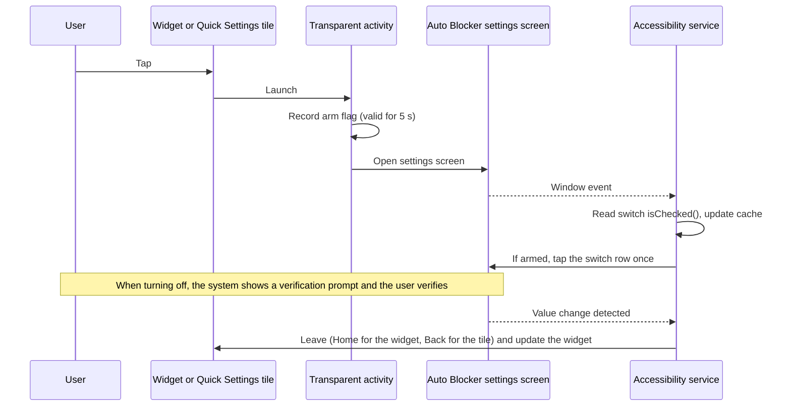

# ShieldTap guide

<p align="center">
  <strong>English</strong> · <a href="guide.ko.md">한국어</a>
</p>

Back to the [README](../README.md). This guide holds the details the README links to: widget states, compatibility, every setup step, updates, the adb path, automation apps, how the app works, security notes and limitations.

## Widget states

<p align="center">
  
</p>

| State | Background | Shows (English UI) |
|---|---|---|
| On | Green | `On` `Checked HH:mm` |
| Off | Amber | `Off` `Checked HH:mm` |
| Unknown | Slate | `Unknown` |

`Checked HH:mm` is the time the switch state was last read. It is not shown in the unknown state. The widget has no title line; the shield icon and the state say what it controls.

The widget can be resized. At about one cell wide it shows only the shield icon. Each widget has its own style: Color (top row) or Monochrome (bottom row). Monochrome tells the three states apart by brightness: On is light, Off is dark and Unknown is in between. A third style, Custom, sets a background color for each state from 20 presets, hue, saturation and brightness sliders or a #RRGGBB code, and picks white or dark text, whichever contrasts more. On Android 12 and later a fourth style, System colors, takes its colors from your wallpaper: a light accent tone for On, a dark neutral for Off and a mid neutral for Unknown. The image above has no System colors row because those colors differ with each wallpaper. Touch and hold the widget and open its settings to switch styles.

The image is not a screenshot. It is a preview drawn from `res/layout/widget.xml` and the drawable definitions, with the English strings. The real widget size, corners and font vary a little by launcher and device.

## Quick Settings tile

ShieldTap also adds a Quick Settings tile. Pull down the notification shade, open the tile editor (the pencil icon or Edit) and drag the ShieldTap tile into your active tiles. The tile reads the same cache as the widget. It is highlighted when Auto Blocker is On, and its second line shows `On`, `Off` or `Unknown` on Android 10 and later. Tapping it runs the same path as a widget tap and closes the shade. Unlike the widget, it does not go to the home screen afterwards. It sends Back once to close the Auto Blocker screen, so you return to the screen you were on. On a locked phone it asks you to unlock first. If accessibility is off, the setup screen opens instead.

## Automation (MacroDroid, Tasker)

Automation apps such as MacroDroid and Tasker can ask ShieldTap to turn Auto Blocker on or off. The automation app decides when, for example when a screen shows the Auto Blocker block message. ShieldTap carries out the request the same way as a widget tap.

| Request | Intent action | App shortcut (ID) |
|---|---|---|
| Turn on | `com.gml.autoblocker.action.TURN_ON` | `Turn on Auto Blocker` (`turn_on`) |
| Turn off | `com.gml.autoblocker.action.TURN_OFF` | `Turn off Auto Blocker` (`turn_off`) |

Both actions start the activity `com.gml.autoblocker/.ActionActivity` (class `com.gml.autoblocker.ActionActivity`, category `android.intent.category.DEFAULT`). There is no toggle action. Extras are ignored, and a call to the component without one of the two actions does nothing. The two app shortcuts open the same activity. They appear when you touch and hold the ShieldTap icon, and they serve automation apps that can only run shortcuts.

- If accessibility is off, the setup screen opens, as with a widget tap.
- Otherwise ShieldTap opens the Auto Blocker screen and taps the switch once. If the switch is already in the requested state, it taps nothing.
- **Returns to the screen you were on.** After the switch changes, or right away when it already matched, ShieldTap sends Back once instead of Home. That closes the Auto Blocker screen and shows the app you were using, such as the install screen that Auto Blocker had just blocked.
- **Turning off still needs your fingerprint or PIN.** One UI shows the verification prompt, and an automation app cannot pass it for you.

**MacroDroid example (verified on the Galaxy Z Fold8).** Trigger: Screen Content, matching the text of the Auto Blocker block message on your phone. On a phone set to Korean the APK install block reads `출처를 알 수 없는 앱 차단됨`. After you verify, you return to the install screen. Action: Send Intent with Target `Activity`, Action `com.gml.autoblocker.action.TURN_OFF` and Package `com.gml.autoblocker`. Screen Content needs the MacroDroid accessibility service and checks the screen every 2 seconds in the free version. The macro editor also shows the trigger text, so MacroDroid can fire the macro on its own screen. Turn on Don't read when MacroDroid is open, reached from the Read Screen Update Rate link in the trigger settings. The Launch Shortcut action lists only older-style shortcuts, so the ShieldTap app shortcuts may not appear there (not verified).

**Tasker example (not verified on a device).** Profile: Event > Plugin > AutoInput > UI Update, with the block message in its text filter. Add an App context with Tasker selected and Invert on, so the profile does not fire on the Tasker editor. Task: Send Intent with Action `com.gml.autoblocker.action.TURN_OFF`, Package `com.gml.autoblocker`, Class `com.gml.autoblocker.ActionActivity` and Target `Activity`. Tasker has no built-in trigger for text on the screen, so the trigger needs the AutoInput plugin. Tasker also cannot run app shortcuts of other apps, so use Send Intent. On Android 10 and later the Tasker FAQ asks you to allow Draw over other apps for actions that open screens.

With adb you can try it directly: `adb shell am start -a com.gml.autoblocker.action.TURN_ON`.

- **Not verified.** The menu names above were not checked on a device, and no automation app has been tested with ShieldTap yet. Whether Samsung Modes and Routines can start these actions or shortcuts is also not verified. Android 10 and later limit activity starts from the background, so an automation app may need its own permission, such as Display over other apps, before the request reaches ShieldTap.
- **Why no caller permission.** MacroDroid and Tasker cannot hold a custom permission declared by ShieldTap, so a permission check would shut them out. Turning on only raises protection. Turning off still goes through One UI verification. Any app on the phone can send these actions, and the most it can do is open the Auto Blocker screen or bring up the verification prompt. ShieldTap still requests no permissions, and the accessibility service still receives events only from the Auto Blocker package.

## Compatibility

| Item | Value |
|---|---|
| Verified on | Galaxy Z Fold8 (SM-F971N), One UI 9.0, on both the main screen and the cover screen home |
| Required apps | Nothing to install. Auto Blocker (`com.samsung.android.rampart`) is a system app built into One UI 6 and later |
| Minimum to work | One UI 6.0 (based on Android 14), because Auto Blocker was introduced in One UI 6 |
| Minimum to install | Android 8.0 (API 26, `minSdkVersion`). Below One UI 6 the app installs but has nothing to toggle |
| Language | English and Korean. The app follows the phone language. You can pick System default, English or 한국어 under Language at the bottom of the app screen. On Android 13 and later this is the same value as Settings > Apps > ShieldTap > Language |
| Other models | Screen size and resolution do not enter into it, because the switch is found by its internal ID, not by screen coordinates. Only one device is verified so far |
| Other One UI versions | Not verified. If Samsung changes the internal IDs on the settings screen, ShieldTap stops working |

## Install step by step

This procedure was verified on a Galaxy Z Fold8 running One UI 9.0, including the setup screen and the widget on the cover screen home. Other models and One UI versions were not tested. If you get stuck, use [Install with adb](#install-with-adb).

### Before you install

1. **Turn off Auto Blocker first.** Settings > Security and privacy > Auto Blocker. While it is on, installing APKs from outside official stores is blocked ([Samsung support](https://www.samsung.com/us/support/answer/ANS10003636)).
2. **Temporarily turn off Play Protect app scanning.** Play Store > profile icon at the top right > Play Protect > ⚙ at the top right > turn off `Scan apps with Play Protect`. While it is on, installation is blocked with a message that the app was blocked to protect your device. Play Protect blocks APKs downloaded from a browser or messenger when they request accessibility access ([Google Security Blog](https://security.googleblog.com/2024/02/piloting-new-ways-to-protect-Android-users-from%20financial-fraud.html)). ShieldTap runs as an accessibility service, so it hits this rule.

### Install and set up

3. Download `shieldtap-v<version>.apk` from the [latest release](https://github.com/shieldtap/shieldtap/releases/latest) and tap it to install. For extra safety, check that the file matches the SHA-256 in the release notes.
4. **Right after installing, turn Play Protect app scanning back on.** It is the same screen as step 2.
5. Open **ShieldTap** from the app drawer and follow the 5 steps on screen in order. Finished steps change to ✓ and only the remaining steps stay expanded. Tap `Details` on any step to see what to tap and why.
   - **① Allow restricted settings:** tap `Open App info` > ⋮ at the top right > **Allow restricted settings**, verify, then tap `Done`. Android 13 and later block apps installed from outside an app store from using accessibility until you allow it ([Google help](https://support.google.com/android/answer/12623953)). If the ⋮ menu does not show this option, tap `Done`, go to ② and try turning it on once. According to an Android 13 analysis, the option can appear only after you have seen the "Restricted setting" dialog once ([Esper](https://www.esper.io/blog/android-13-sideloading-restriction-harder-malware-abuse-accessibility-apis)). If accessibility is already on, this step is marked ✓ automatically.
   - **② Turn on accessibility:** tap `Open Accessibility settings` and turn on ShieldTap under Accessibility > Installed apps. If a "Restricted setting" dialog appears, go back to ① and allow it.
   - **③ Add the widget to your home screen:** tap `Add widget to home screen` and the system add dialog appears. If there is no button, touch and hold an empty spot on the home screen, tap Widgets and place ShieldTap. It starts at 2x1 and can be resized.
   - **④ Read the current state:** tap `Read state` to open the Auto Blocker settings screen. Do not touch the switch. When the screen opens, tap Back.
   - **⑤ Finish up after installing:** turn the two things you switched off for installing back on. Use `Open Play Protect settings` to turn app scanning on, and `Turn on Auto Blocker` to turn Auto Blocker on. The turn-on button taps nothing if Auto Blocker is already on. When you are done, tap `Finish setup`.
   - **Recommended: turn back on after 30 minutes.** Tap `Open auto turn-on option` to open the Auto Blocker screen. Turn on `Turn on Auto Blocker automatically` there (One UI 8.5 and later), and if you turn Auto Blocker off with the widget and forget, it comes back on after 30 minutes. The option may be near the bottom of the screen.
6. When `All set` appears, you are done. From then on, each tap on the widget switches between On and Off. If you tap the widget while accessibility is off, the setup screen opens.

## Updating and uninstalling

**Updating.** Open ShieldTap from the app drawer and tap `Check for updates` to open the latest release page in your browser. If it is newer than the version shown at the bottom of the app screen, download `shieldtap-v<version>.apk` and install it over the current app. The version in the file name uses the same format as the one in the app, so you can compare them directly. Your settings and widget stay as they are. An update may get a warning with `Install anyway` under More details instead of a hard block, as seen on the verified device. If the install is blocked with no such option, turn off Play Protect app scanning for a moment as with the first install. The app does not check for updates itself so it can stay free of the internet permission.

For new-version notifications, add `https://github.com/shieldtap/shieldtap` to [Obtainium](https://github.com/ImranR98/Obtainium). It watches GitHub releases and tells you when a new version is out. Whether Play Protect also blocks installs made through Obtainium has not been verified.

**Uninstalling.** Touch and hold the ShieldTap icon in the app drawer and tap `Uninstall`, or tap `Open App info (uninstall)` in the app.

## Install with adb

This path was verified on SM-F971N with One UI 9.0. Auto Blocker blocks USB commands while it is on, so turn it off first.

```
adb install -r shieldtap-v<version>.apk
./enable_accessibility.sh <adb-serial>
```

Then open the app as in step 5 of [Install step by step](#install-step-by-step) and follow ③, ④ and ⑤. ① and ② are done when the script turns on accessibility.

`enable_accessibility.sh` turns on the accessibility service with `settings put secure` under shell privileges, so you do not need to touch the phone and you skip the restricted settings step. Before writing, it prints the current `enabled_accessibility_services` value and appends the ShieldTap service with `:` only if it is not already there. It never overwrites the existing value.

## How it works



- **No coordinate taps.** ShieldTap finds the switch row by its internal ID in the accessibility node tree and sends `ACTION_CLICK` to that node (`src/com/gml/autoblocker/AutoTapService.java:102-117`). That is why it depends on the One UI version more than on the device model.
- **Stops if the switch is missing.** If the ID changed and the node is not there, it taps nothing and shows `Couldn't find the switch on the settings screen.` after 5 seconds (`AutoTapService.java:51-64`). Fallbacks such as "the first switch on the screen" are deliberately left out, so it never taps a different switch on the same screen (such as `Maximum restrictions` on One UI 6.1.1 and later).
- **Skips the tap when nothing needs to change.** `Turn on Auto Blocker` in setup asks for On. If the switch is already on, the service taps nothing and goes back to the setup screen (`AutoTapService.java:111-115`).
- The state the widget shows is a cache of the switch state the accessibility service last read from the settings screen. ShieldTap neither reads nor writes the Auto Blocker system setting (`rampart_main_switch_enabled`).
- On every window event of the settings screen, the accessibility service reads `isChecked()` of the switch (`sesl_switchbar_switch`). Only within the 5 seconds the arm flag is valid does it tap the switch row (`sesl_switchbar_container`) once.
- It leaves the Auto Blocker screen only after `isChecked()` on the same window differs from the value before the tap. Until the value changes it sends no Home or Back.
- **Where it goes next depends on what asked.** A widget tap goes to the home screen, as before. The Quick Settings tile, automation requests and `Turn on Auto Blocker` in setup send Back once, which closes the Auto Blocker screen and shows the screen underneath (`AutoTapService.java:122-128`). Back is sent only while the Auto Blocker screen is the active window, so it never dismisses the verification prompt. Tile and automation requests open in a task of their own (`android:taskAffinity=""` at `AndroidManifest.xml:58` and `:68`), so Back does not land on the ShieldTap setup screen left in recents.
- If you cancel verification and the value does not change, it stops watching after 10 seconds and does nothing.
- If you open the Auto Blocker settings screen yourself, ShieldTap taps nothing.

## Security notes

| Check | Evidence |
|---|---|
| No requested permissions (including internet) | 0 `uses-permission` entries in `AndroidManifest.xml` |
| Widget, trampoline and accessibility service are not exported | `android:exported="false"` at `AndroidManifest.xml:33`, `:57` and `:81`. Three activities and one service are exported. The Quick Settings tile (`ShieldTile`, `:95`) is exported because the system binds it, and `android:permission="android.permission.BIND_QUICK_SETTINGS_TILE"` (`:98`) lets only the system bind it. The setup screen opened from the app drawer (`MainActivity`, `:19`) is exported so the launcher can start it, and it declares the two app shortcuts (`:26-28`). The widget style screen (`WidgetConfigActivity`, `:46`) is exported so the launcher can open it when you place or reconfigure the widget. It accepts only widget IDs that belong to ShieldTap and closes for any other ID. The automation entry (`ActionActivity`, `:67`) is covered in the next row |
| Automation entry is exported without a caller permission | `ActionActivity` at `AndroidManifest.xml:67` accepts only `TURN_ON` and `TURN_OFF` (`:73-74`) and drops every extra. MacroDroid and Tasker cannot hold a custom permission. Turning on only raises protection, and turning off still needs One UI fingerprint or PIN verification. No permission is added and the accessibility scope does not change. See [Automation](#automation-macrodroid-tasker) |
| Only one other app is queried: the Play Store | `<queries>` at `AndroidManifest.xml:6-8` declares only `com.android.vending`. This is not a permission. It is the fallback path that opens the Play Store when the Play Protect settings screen cannot be opened |
| Accessibility events limited to the rampart package | `android:packageNames` at `res/xml/accessibility_service_config.xml:3` |
| Backup disabled | `android:allowBackup="false"` at `AndroidManifest.xml:14` |

An accessibility service is a powerful permission, so check the source and the SHA-256 before installing a downloaded APK. Building it yourself is the most reliable option. See [development](../README.md#development).

## Limitations

- Regular apps cannot read `rampart_main_switch_enabled` (`Settings key ... is not readable`, the @hide key restriction in Android 12 and later). It is readable only from adb shell.
- One UI rejects writes to `rampart_main_switch_enabled` (`RAMPART_SettingsProvider: Not allowed to put`), so ShieldTap taps the settings screen UI instead.
- The widget shows a cache, so it can go stale if the state changes elsewhere. The One UI 8.5+ `Turn on Auto Blocker automatically` option turns Auto Blocker back on 30 minutes after it is turned off (observed).
- It stops working if the viewIds on the settings screen change, so it is fragile across One UI updates.
- Turning on Auto Blocker disconnects wireless debugging. Turning it off restores it.
- ShieldTap is not published on Google Play or the Galaxy Store. It is distributed only through GitHub releases.
- After a tile or automation request, Back returns to the previous screen only if the Auto Blocker screen opens as a fresh screen of its own. If you had left Auto Blocker open on a deeper page, Back may show that Auto Blocker page instead (inferred, not verified on a device).

## Icon credits

The outline of the shield icons (`res/drawable/ic_shield_*.xml` and the app icon `res/drawable/ic_launcher_fg.xml`) is the `verified_user` (outlined) path from Google [Material Icons](https://github.com/google/material-design-icons), with a check mark and dot added. Material Icons is also licensed under Apache License 2.0. When distributing ShieldTap, include `LICENSE` and `NOTICE`.
